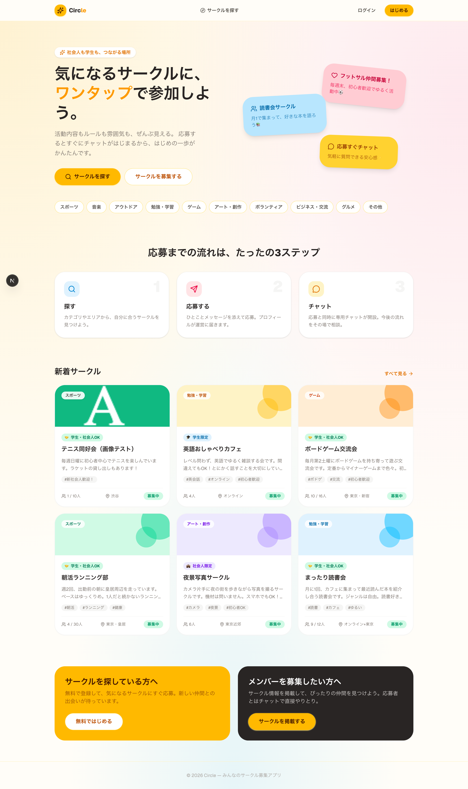
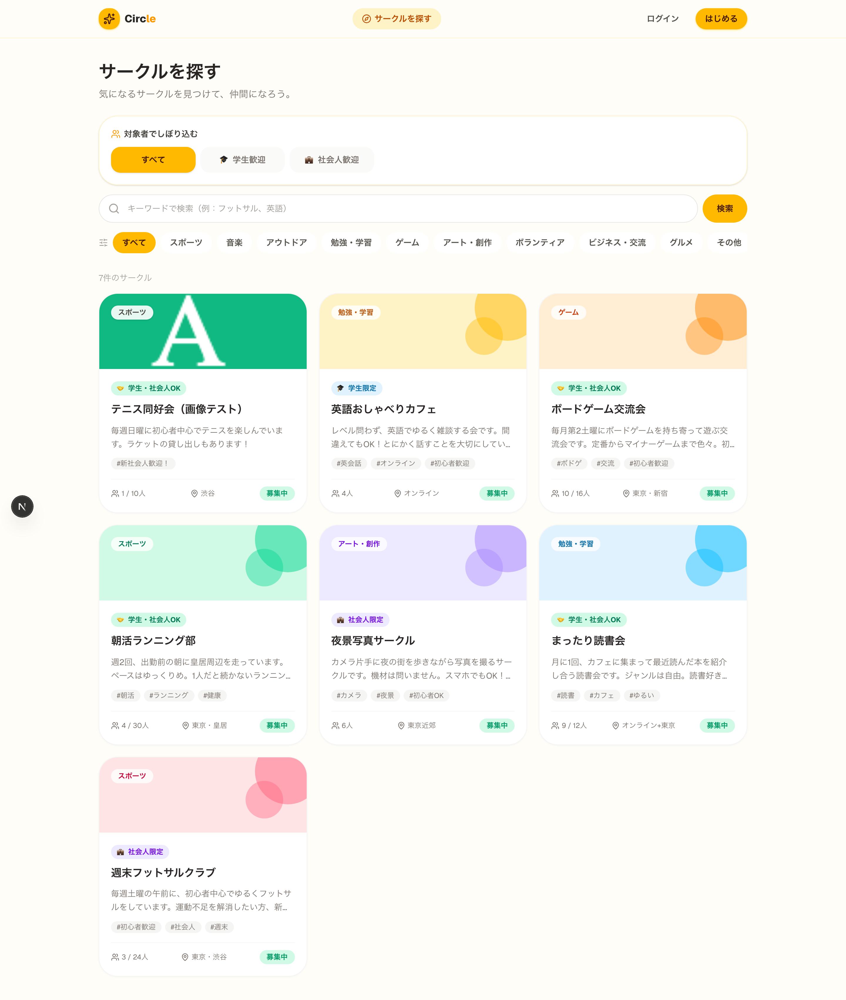
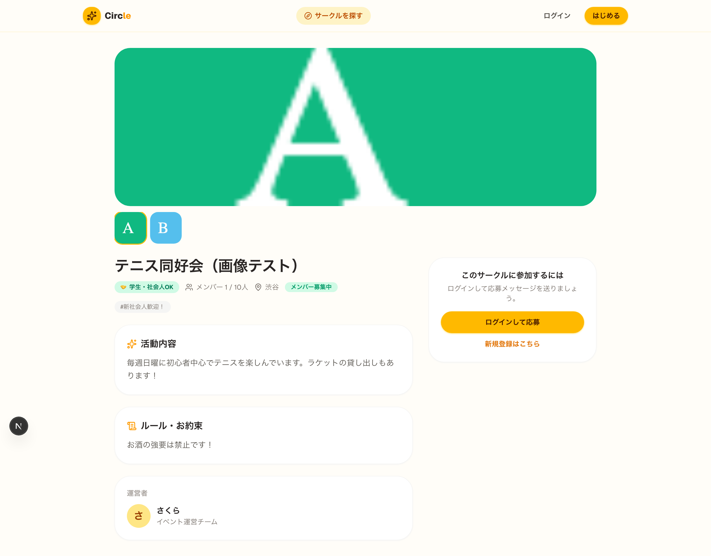

# Circle — サークルメンバー募集アプリ

社会人・学生サークルのメンバー募集と参加ができる Web アプリです。
募集する側（運営）と探す側（一般ユーザー）に分かれ、応募すると運営に
プロフィールが届き、**同時に専用チャットルームが開設**されます。

## スクリーンショット

### トップページとサークル検索

<table>
  <tr>
    <td width="50%">
      <strong>トップページ</strong><br>
      
    </td>
    <td width="50%">
      <strong>サークル検索</strong><br>
      
    </td>
  </tr>
</table>

### サークル詳細




## 主な機能

-  **認証**（BetterAuth / メール+パスワード）
-  **サークル検索**（対象者・カテゴリ・キーワード絞り込み）
-  **対象者**（学生限定／社会人限定／学生・社会人OK）で検索上部からワンタップ絞り込み
-  **サークル掲載**（名前・活動内容・ルール・人数・タグ・画像最大5枚）
-  **画像アップロード**（1枚目が一覧サムネイル/メイン画像。詳細はギャラリー表示）
-  **応募フロー**：応募 → 運営に応募者プロフィールが届く → チャットルーム自動生成
-  **リアルタイムチャット**（SSE ベース・外部サービス不要）
-  **運営ダッシュボード**（応募者一覧・参加承認/見送り）
-  **マイページ**（プロフィール編集・応募履歴）

## 技術スタック

| 領域 | 技術 |
| --- | --- |
| フレームワーク | Next.js 16（App Router）/ React 19 / TypeScript |
| スタイリング | Tailwind CSS v4 |
| 認証 | BetterAuth |
| DB | PostgreSQL + Prisma |
| リアルタイム | Server-Sent Events（`src/lib/realtime.ts`） |

## セットアップ

### 1. 依存インストール

```bash
pnpm install
```

### 2. 環境変数

`.env`（コミット済みのサンプル値で動きます）を確認。本番では
`BETTER_AUTH_SECRET` を再生成してください。

```bash
openssl rand -base64 32   # → BETTER_AUTH_SECRET
```

### 3. データベース（PostgreSQL / Docker）

```bash
pnpm db:up      # docker compose で Postgres を起動
pnpm db:push    # スキーマを反映
pnpm db:seed    # デモデータ投入（任意）
```

### 4. 開発サーバー

```bash
pnpm dev
```

> ⚠️ ポート 3000 が他プロセス（Docker 等）で使用中の場合、Next は自動で
> 3001 以降を使います。`http://localhost:3000` が別物を表示するときは
> ターミナルに出る `Local: http://localhost:XXXX` を確認してください。

### デモアカウント（seed 実行時）

| 役割 | メール | パスワード |
| --- | --- | --- |
| 募集側（運営） | `organizer@example.com` | `password123` |
| 応募側（一般） | `taro@example.com` | `password123` |

## ディレクトリ構成

```
src/
├── app/
│   ├── actions/            サーバーアクション（circles / applications / chat / profile）
│   ├── api/
│   │   ├── auth/[...all]/   BetterAuth ハンドラ
│   │   └── chat/[roomId]/stream/  チャット用 SSE
│   ├── circles/            一覧・詳細・作成・編集
│   ├── chat/               チャット一覧・ルーム
│   ├── dashboard/          運営ダッシュボード
│   ├── me/                 マイページ
│   ├── login / signup      認証画面
│   └── page.tsx            ランディング
├── components/             UI・Navbar・各フォーム・ChatRoom
└── lib/                    auth / prisma / session / realtime / constants
```

## 本番運用メモ

- リアルタイムチャットは単一インスタンス前提のインメモリ Pub/Sub です。
  複数インスタンスで動かす場合は `src/lib/realtime.ts` を Redis Pub/Sub などに
  置き換えてください。
- アップロード画像はローカルの `public/uploads/circles/` に保存されます
  （`/api/upload`）。Vercel などのサーバーレス環境では永続化されないため、
  本番では S3 / Cloudinary 等のオブジェクトストレージへ差し替えてください。
- `kysely` は `0.28.17` に固定しています（BetterAuth の kysely-adapter が
  参照する定数が 0.29 系のルートエクスポートから外れているため）。
