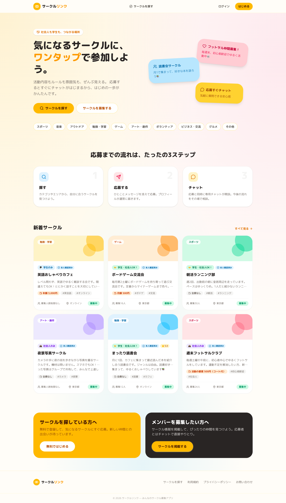
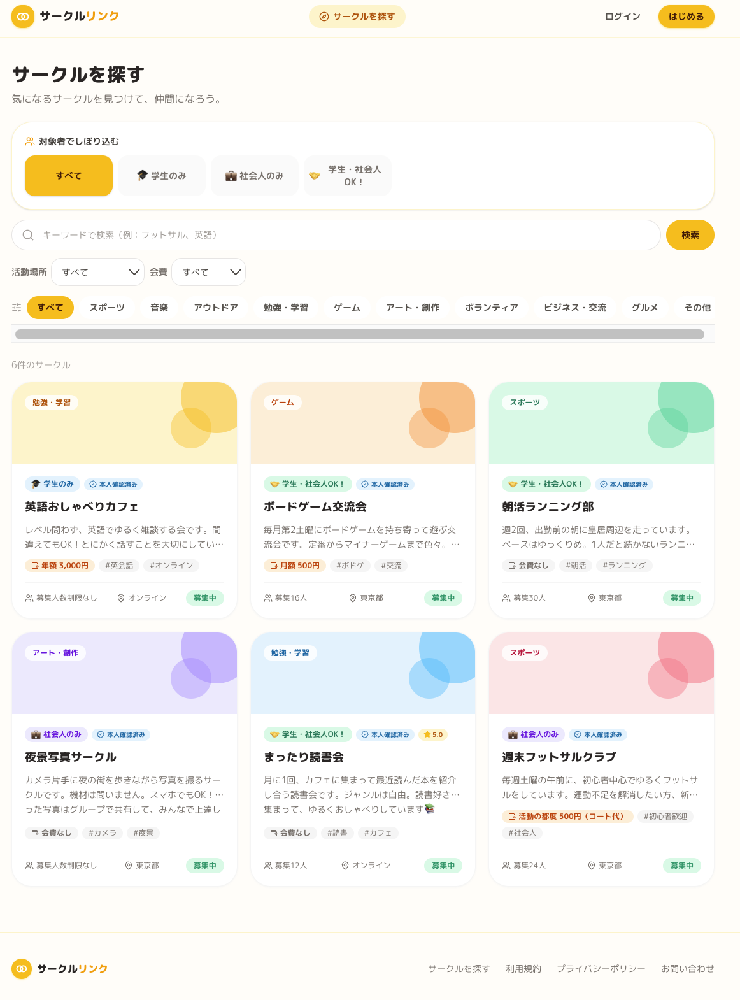
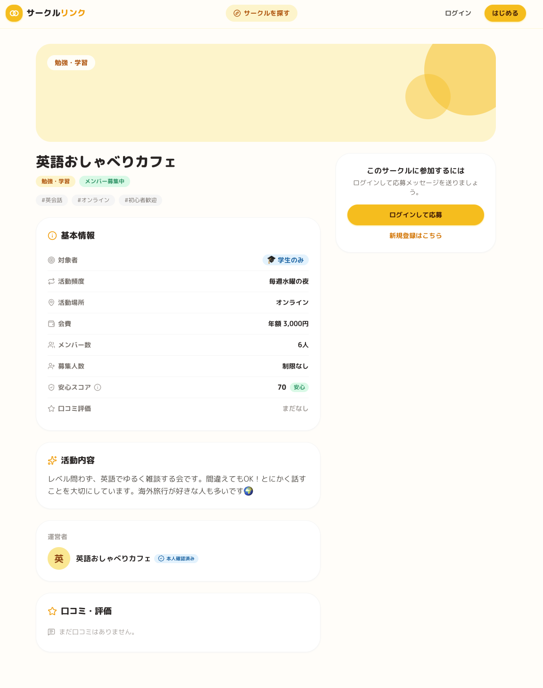

# サークルリンク（CircleLink） — サークルメンバー募集アプリ

社会人・学生サークルのメンバー募集と参加ができる Web アプリです。
募集する側（運営）と探す側（一般ユーザー）に分かれ、応募すると運営に
プロフィールが届き、**同時に専用チャットルームが開設**されます。

※本プロジェクトは学部生の際にローカル環境で開発し、ポートフォリオとして本リポジトリにアーカイブしたものです。

## スクリーンショット

### トップページとサークル検索

<table>
  <tr>
    <td width="50%">
      <strong>トップページ</strong><br>
      
    </td>
    <td width="50%">
      <strong>サークル検索</strong><br>
      
    </td>
  </tr>
</table>

### サークル詳細




## 主な機能

-  **認証**（BetterAuth / メール+パスワード）
-  **サークル検索**（対象者・カテゴリ・キーワード絞り込み）
-  **対象者**（学生限定／社会人限定／学生・社会人OK）で検索上部からワンタップ絞り込み
-  **サークル掲載**（名前・活動内容・ルール・人数・タグ・画像最大5枚）
-  **画像アップロード**（1枚目が一覧サムネイル/メイン画像。詳細はギャラリー表示）
-  **応募フロー**：応募 → 運営に応募者プロフィールが届く → チャットルーム自動生成
-  **リアルタイムチャット**（SSE ベース・外部サービス不要）
-  **運営ダッシュボード**（応募者一覧・参加承認/見送り）
-  **マイページ**（プロフィール編集・応募履歴）

## 技術スタック

| 領域 | 技術 |
| --- | --- |
| フレームワーク | Next.js 16（App Router）/ React 19 / TypeScript |
| スタイリング | Tailwind CSS v4 |
| 認証 | BetterAuth |
| DB | PostgreSQL + Prisma |
| リアルタイム | Server-Sent Events（`src/lib/realtime.ts`） |

## セットアップ

### 1. 依存インストール

```bash
pnpm install
```

### 2. 環境変数

`.env`（コミット済みのサンプル値で動きます）を確認。本番では
`BETTER_AUTH_SECRET` を再生成してください。

```bash
openssl rand -base64 32   # → BETTER_AUTH_SECRET
```

### 3. データベース（PostgreSQL / Docker）

```bash
pnpm db:up      # docker compose で Postgres を起動
pnpm db:push    # スキーマを反映
pnpm db:seed    # デモデータ投入（任意）
```

### 4. 開発サーバー

```bash
pnpm dev
```

> ⚠️ ポート 3000 が他プロセス（Docker 等）で使用中の場合、Next は自動で
> 3001 以降を使います。`http://localhost:3000` が別物を表示するときは
> ターミナルに出る `Local: http://localhost:XXXX` を確認してください。

### デモアカウント（seed 実行時）

| 役割 | メール | パスワード |
| --- | --- | --- |
| 募集側（運営） | `organizer@example.com` | `password123` |
| 応募側（一般） | `taro@example.com` | `password123` |

## ディレクトリ構成

```
src/
├── app/
│   ├── actions/            サーバーアクション（circles / applications / chat / profile）
│   ├── api/
│   │   ├── auth/[...all]/   BetterAuth ハンドラ
│   │   └── chat/[roomId]/stream/  チャット用 SSE
│   ├── circles/            一覧・詳細・作成・編集
│   ├── chat/               チャット一覧・ルーム
│   ├── dashboard/          運営ダッシュボード
│   ├── me/                 マイページ
│   ├── login / signup      認証画面
│   └── page.tsx            ランディング
├── components/             UI・Navbar・各フォーム・ChatRoom
└── lib/                    auth / prisma / session / realtime / constants
```

## デプロイ（Render / 常駐Node・単一インスタンス）

リアルタイムチャットはサーバーのメモリ上の Pub/Sub ＋ SSE で動くため、
**常駐プロセスかつ単一インスタンス**で運用します。リポジトリ同梱の
[`render.yaml`](render.yaml) を使うと、Web サービス＋PostgreSQL＋永続ディスクが
一括で作成されます（ディスクを付けると Render は自動的に単一インスタンスになります）。

### 手順
1. このリポジトリ（`render.yaml` を含む）を GitHub に push する。
2. [Render](https://render.com) にサインアップ → **New +** → **Blueprint** → このリポジトリを選択 → `render.yaml` が検出されるので **Apply**。
3. 初回デプロイ後にサービスURL（例: `https://circlelink.onrender.com`）が決まる。
4. そのURLを環境変数に設定（Render: サービス → **Environment**）：
   - `BETTER_AUTH_URL` = `https://<あなたのURL>`
   - `NEXT_PUBLIC_APP_URL` = `https://<あなたのURL>`
   - 保存すると自動で再デプロイされる（`NEXT_PUBLIC_*` はビルド時に埋め込まれるため再ビルドが必要）。
5. （任意）メールを使うなら `RESEND_API_KEY` / `EMAIL_FROM` / `REPORT_TO_EMAIL` を設定。
6. デプロイ時に `prisma migrate deploy` が自動実行され、DBにテーブルが作成される。
7. （任意）デモデータを入れる場合は Render の **Shell** で `pnpm db:seed`。

### 注意
- 常駐＋永続ディスクには有料プラン（`starter`）が必要です。無料プランはスピンダウン＆ディスク非対応のため、SSE と画像保存が機能しません。
- 永続ディスクにより **単一インスタンス固定**になります（＝リアルタイムが正しく動く）。水平スケールしたくなったら、`src/lib/realtime.ts` を Redis Pub/Sub 等に、画像を S3 / Cloudflare R2 等に置き換えてください（ルートB）。
- Railway / Fly.io / VPS でも同様に「常駐Node＋単一インスタンス＋永続ボリューム」で動きます。

## 実装メモ

- 画像は `UPLOAD_DIR`（未設定時は `./uploads`、本番は `/data/uploads`）に保存し、
  `/api/uploads/...` 経由で配信します（[`src/lib/uploads.ts`](src/lib/uploads.ts)）。
- DBスキーマは Prisma マイグレーション管理です。ローカルでスキーマを変えたら
  `pnpm db:migrate`（`prisma migrate dev`）、本番は `prisma migrate deploy`（デプロイ時に自動）。
- `kysely` は `0.28.17` に固定しています（BetterAuth の kysely-adapter が
  参照する定数が 0.29 系のルートエクスポートから外れているため）。
